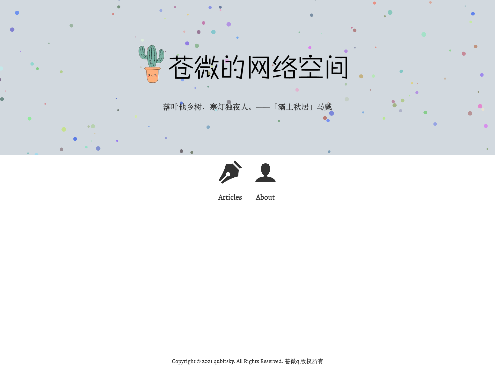
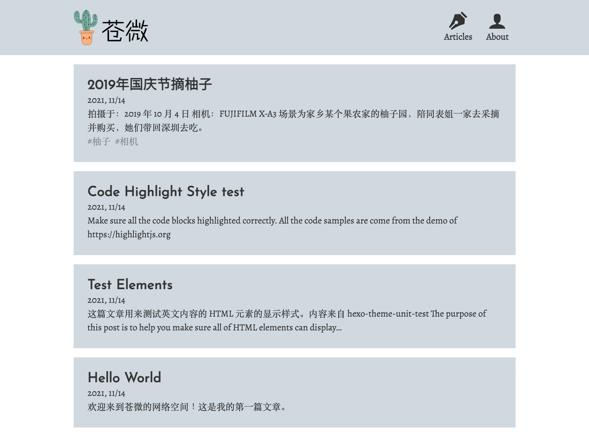
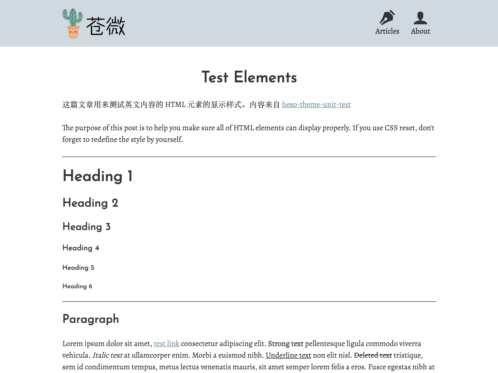

记录一下网站的 0.1 版本。

- 字体：从 [google fonts](https://fonts.google.com/) 选取
  - 标题：无衬线字体 “Josefin Sans”（英文）与 “Noto Sans SC”（中文）搭配，体现现代和艺术感
  - 正文：衬线字体 “Alegreya”（英文）与 “Songti SC”（中文）搭配，体现典雅和阅读感
- 排版：使用 [typography.js](https://kyleamathews.github.io/typography.js/) 规则进行排版
- 主题：使用 [theme-ui](https://theme-ui.com/) 构建主题系统
  - 配色：苍色，选自 https://colors.ichuantong.cn/
  - 代码高亮：使用 [prism-react-renderer](https://github.com/FormidableLabs/prism-react-renderer) 工具渲染代码块
- 功能
  - 粒子效果：使用 [react-tsparticles](https://www.npmjs.com/package/react-tsparticles) 实现
  - [今日诗词](https://www.jinrishici.com/)
  - 文章生成：编辑 Markdown 文件，然后由 gatsby 的 createPages 方法生成
  - 404动画：使用 [@lottiefiles/react-lottie-player](https://www.npmjs.com/package/@lottiefiles/react-lottie-player)，动画资源可以到 https://lottiefiles.com/ 搜索
- 技术：基于 gatsby 构建
  - gatsby-plugin-theme-ui
  - gatsby-plugin-mdx
  - @theme-ui/typography
  - prism-react-renderer
  - react-tsparticles
  - jinrishici
  - @lottiefiles/react-lottie-player

## 外观快照

